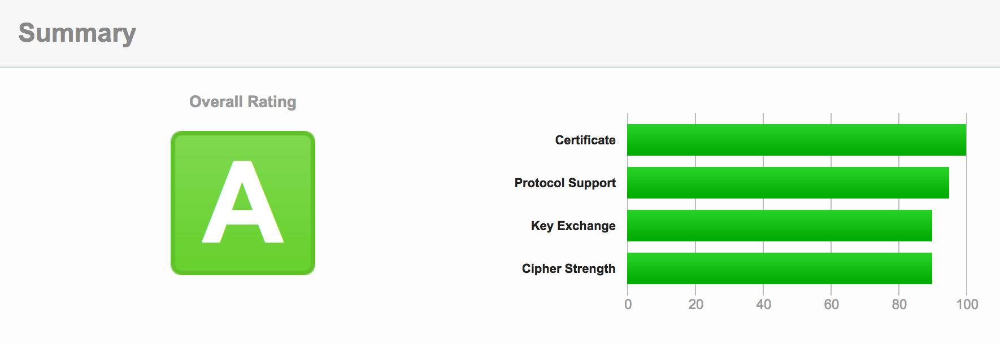
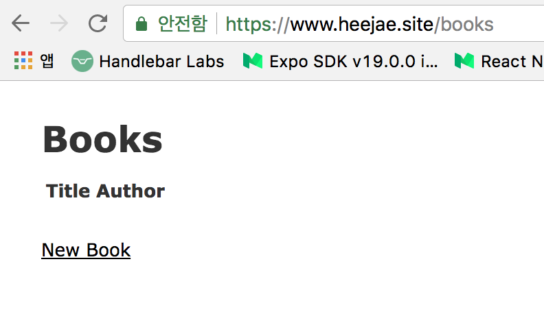

LIKELION X Korea Univ.

Author : 채희재

✉️  poongnewga@gmail.com

---

# HTTPS 적용하기

AWS EC2에서 Ubuntu를 선택 후 기본 설정에 HTTP, HTTPS 포트를 열어준 다음,

다음 명령어들을 후두루 챱챱!

1. Rbenv로 Ruby 설치

```shell
sudo apt-get update

sudo apt-get install git-core curl zlib1g-dev build-essential libssl-dev libreadline-dev libyaml-dev libsqlite3-dev sqlite3 libxml2-dev libxslt1-dev libcurl4-openssl-dev python-software-properties libffi-dev nodejs -y

git clone https://github.com/rbenv/rbenv.git ~/.rbenv

echo 'export PATH="$HOME/.rbenv/bin:$PATH"' >> ~/.bashrc

echo 'eval "$(rbenv init -)"' >> ~/.bashrc

exec $SHELL

git clone git://github.com/sstephenson/ruby-build.git ~/.rbenv/plugins/ruby-build

echo 'export PATH="$HOME/.rbenv/plugins/ruby-build/bin:$PATH"' >> ~/.bashrc

exec $SHELL


rbenv install 2.3.3
rbenv global 2.3.3

ruby -v

# 버전이 제대로 출력되면 루비 설치 성공!
```

<div style="page-break-after: always;"></div>

2. Bundler 설치

```shell
gem install bundler
```


3. Node 설치

```shell
curl -sL https://deb.nodesource.com/setup_8.x | sudo -E bash -

sudo apt-get install -y nodejs
```


4. Rails 설치

```shell
gem install rails -v 5.0.2 --no-ri --no-rdoc

rbenv rehash

rails -v
```


5. NGINX 설치

```shell
sudo apt-key adv --keyserver hkp://keyserver.ubuntu.com:80 --recv-keys 561F9B9CAC40B2F7

sudo apt-get install -y apt-transport-https ca-certificates

sudo sh -c 'echo deb https://oss-binaries.phusionpassenger.com/apt/passenger xenial main > /etc/apt/sources.list.d/passenger.list'

sudo apt-get update

sudo apt-get install -y nginx-extras passenger

# NGINX 설치 끝, 다음 명령어로 서버 시작(정지)(재시작) 가능
# sudo service nginx start(stop)(restart)
```

<div style="page-break-after: always;"></div>

6. Certbot 설치

```shell
sudo add-apt-repository ppa:certbot/certbot
# Enter를 눌러준다.
sudo apt-get update
sudo apt-get install python-certbot-nginx -y
```


7. NGINX 설정

```shell
sudo vim /etc/nginx/sites-available/default

# 41번 행의 server_name _; 의 _ 부분을
# 자신의 도메인으로 수정해준다.

server_name example.com www.example.com;
# ESC + :wq 로 저장 및 종료한다.

sudo nginx -t
# nginx: the configuration file /etc/nginx/nginx.conf syntax is ok
# nginx: configuration file /etc/nginx/nginx.conf test is successful
# 라는 메세지가 정상적으로 뜨는 지 확인한다.

sudo systemctl reload nginx
# NGINX 리로드
```


8. 방화벽 업데이트

```shell
# 먼저 서버를 켭니다.
sudo service nginx start

sudo ufw status
# Status: inactive 라고 뜰 것이다. active로 바꾸자.

sudo ufw enable
# y 라고 입력

sudo ufw allow 'Nginx Full'
sudo ufw allow OpenSSH
```

<div style="page-break-after: always;"></div>

9. SSL 인증서 받기

```shell
# AWS 인스턴스의 IP 주소를 example.com / www.example.com 에 연결해두고 시작.
sudo certbot --nginx -d example.com -d www.example.com
# email 입력
# Agree / Yes 입력
# 2 (Redirect) 입력
# 접속해보면 자동으로 https로 연결됩니다. 적용되기까지 조금 시간이 걸립니다.

# 성공적으로 인증서가 설치되면 아래와 같은 메세지가 뜹니다.
-------------------------------------------------------------------------------
Congratulations! You have successfully enabled https://heejae.site and
https://www.heejae.site

You should test your configuration at:
https://www.ssllabs.com/ssltest/analyze.html?d=heejae.site
https://www.ssllabs.com/ssltest/analyze.html?d=www.heejae.site
-------------------------------------------------------------------------------

IMPORTANT NOTES:
 - Congratulations! Your certificate and chain have been saved at:
   /etc/letsencrypt/live/heejae.site/fullchain.pem
   Your key file has been saved at:
   /etc/letsencrypt/live/heejae.site/privkey.pem
   Your cert will expire on 2018-01-05. To obtain a new or tweaked
   version of this certificate in the future, simply run certbot again
   with the "certonly" option. To non-interactively renew *all* of
   your certificates, run "certbot renew"
 - If you like Certbot, please consider supporting our work by:

   Donating to ISRG / Let's Encrypt:   https://letsencrypt.org/donate
   Donating to EFF:                    https://eff.org/donate-le
```

<div style="page-break-after: always;"></div>

10. Diffie-Hellman 매개 변수 업데이트를 통한 보안성 강화 : 위의 테스트 사이트 링크(https://www.ssllabs.com/ssltest/analyze.html?d=example.com) 에서 테스트를 해보면 B등급이 나옵니다. A등급으로 올려줍시다 :)

```shell
sudo openssl dhparam -out /etc/ssl/certs/dhparam.pem 2048

# 16번째 줄의 server { 아래에 붙여넣기 해줍니다.
sudo vim /etc/nginx/sites-available/default
# ESC + :wq 로 저장 후
sudo nginx -t
# nginx: the configuration file /etc/nginx/nginx.conf syntax is ok
# nginx: configuration file /etc/nginx/nginx.conf test is successful 라고 떠야 제대로 설정이 완료된 것입니다.

sudo systemctl reload nginx
# NGINX 리로드
# 이제 A등급이 됩니다.
```




<div style="page-break-after: always;"></div>

11. 인증서 자동 갱신 설정 : 인증서는 90일만 유효하기 때문에 매번 갱신해줘야 하는데 이는 매우 귀찮습니다. 우리는 똑똑이니까 자동화를 해줍시다.

```shell
sudo crontab -e
# 텍스트 에디터를 자유롭게 선택합니다. 저는 3의 vim을 선택합니다.
# 마지막 줄에 다음을 추가하고 저장합니다.
15 3 * * * /usr/bin/certbot renew --quiet
# 매일 갱신 명령을 수행합니다. 이는 인증서가 만료 30일 이내에 자동 갱신되고 다시 로드되게 합니다.
```


12. NGINX 추가 설정(Rails를 위한)

```shell
# 환경설정 파일을 엽니다.
sudo vim /etc/nginx/nginx.conf

# 1번째 줄을 다음으로 수정합니다. user www-data => ubuntu
user ubuntu;

# 63번째 줄의 #을 지워 주석을 해제하여 다음과 같은 상태가 되게 한다.
include /etc/nginx/passenger.conf;

# passenger 설정 파일을 엽니다.
sudo vim /etc/nginx/passenger.conf

# 모든 내용을 지우고 다음 내용으로 대체합니다.
passenger_root /usr/lib/ruby/vendor_ruby/phusion_passenger/locations.ini;  
passenger_ruby /home/ubuntu/.rbenv/shims/ruby;

# 서버를 재시작합니다.
sudo service nginx restart
```

<div style="page-break-after: always;"></div>

13. Rails 프로젝트 생성

```shell
# 루트 디렉토리(cd ~ 를 하면 이동할 수 있습니다.)에서 다음을 입력합니다.
# 아래의 프로젝트폴더명인 myproject는 원하는 대로 변경해도 됩니다.
rails new myproject
cd myproject
rails g controller home index
rails g scaffold book title author

rails db:migrate RAILS_ENV=production
rails assets:precompile RAILS_ENV=production

# 이제 간단한 컨트롤러와 스캐폴드를 생성했습니다.
# config/routes.rb 에서 root 페이지는 적당히 잡아줍시다.
```


14. 프로젝트 폴더 NGINX에 연결

```shell
# 프로젝트 폴더 연결을 위해 환경설정 파일을 다시 엽니다.
sudo vim /etc/nginx/sites-enabled/default

# 37번째 줄에 있는 root를 수정합니다.
root         /home/ubuntu/[프로젝트폴더명]/public;

# 위에서 수정했던 41~42번째 줄쯤에 있는 server_name 아래에 다음을 추가합니다.
passenger_enabled on;
rails_env    production;

# 바로 아래의 location / { ... } 부분을 지우고 다음을 추가하고 저장합니다.
error_page   500 502 503 504  /50x.html;
location = /50x.html {
    root   html;
}
```

<div style="page-break-after: always;"></div>

15. Secret Key 설정

```shell
# Gemfile을 엽니다.
vim Gemfile

# figaro 젬을 추가하고 저장합니다.
gem 'figaro'

# 젬을 설치합니다.
bundle install

# figaro를 실행합니다.
bundle exec figaro install

# config 폴더로 이동해서 다음을 실행한 뒤, 나오는 Secret Key를 복사합니다.
cd config
rails secret
# 아래와 같은 키가 출력되는데 이를 드래그하여 복사해줍니다.
1913b53b41fd8a76dd660efcbf8cda24c0ee01476084adc7ef957a8804ea9df0523fcb1d0ccbfbaee0aa40ecbc89054249a765bc94b9851c1ea9de60df35fdec

# application.yml을 엽니다.
vim application.yml

# 복사했던 키를 다음과 같이 정의해준 뒤 저장합니다.
SECRET_KEY_BASE: 1913b53b41fd8a76dd660efcbf8cda24c0ee01476084adc7ef957a8804ea9df0523fcb1d0ccbfbaee0aa40ecbc89054249a765bc94b9851c1ea9de60df35fdec

# 서버를 재시작합니다.
sudo service nginx restart
```

<div style="page-break-after: always;"></div>

# BAAM!!




---

LIKELION X Korea Univ.

Author : 채희재

출처 : 필자 본인, Digitalocean : https://www.digitalocean.com/community/tutorials/how-to-secure-nginx-with-let-s-encrypt-on-ubuntu-16-04

✉️  poongnewga@gmail.com

------


